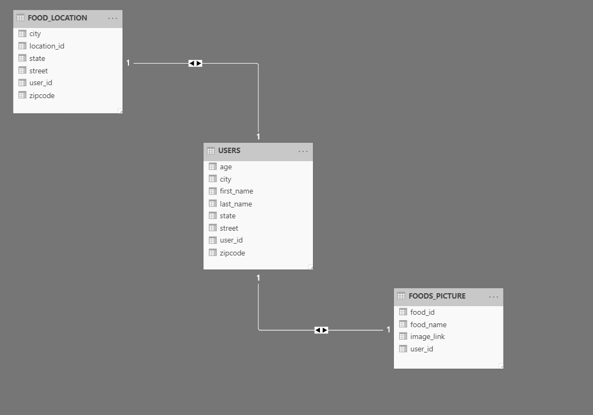

# What we need
    - location of where picture is taken
    - What food is it
        1. origination of food
        2. price of food
        3. 
    - Time picture is taken
        1. year
        2. month
        3. season
        4. days
        5. time
    - Device is taken off
    - use linkedin log in to identify user profession.
        1. does engineer likes vege?
        
    - use google to log in
        1. age of person

#TABLES
    - user table
        1. first name
        2. last name
        3. age
        4. Street
        5. City
        6. State
        7. Zipcode
    - food table
        1. link of image
        2. google vision api result
        3. user foreign key
    - location table
        1. street
        2. City
        3. State
        4. Zipcode
        5. Foreign key of food

# ENTITY DIAGRAM

